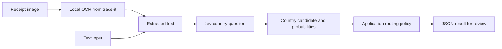

# How the receipt classifier works

## The task in plain language

Imagine sorting a box of receipts into country folders. This project asks where the
selling store is located. It does not classify product origin, the customer's home,
or the retailer's headquarters.

1. **Read the receipt.** The local OCR turns pixels into text. PDF pages can use
   their existing text layer. Typed or transcribed text skips OCR entirely.
2. **Interpret the clues.** Jev receives text and predefined questions. It chooses
   one of seven countries, OTHER for evidence of an unlisted country, or UNKNOWN
   for insufficient or conflicting evidence.
3. **Route the result.** Python code validates the response, records probabilities
   and applies a policy. The published policy disables automatic acceptance, so
   candidates are returned for review. Provider failures remain explicit errors.

Jev is a hosted decision model; the OCR runs locally. This project trained neither
model. A correct country guess does not mean every word was transcribed correctly.

## Original versus focused prompt

A prompt is the instruction given to Jev alongside the receipt. The exact versioned
instructions and country criteria are in [prompts.py](../jev_tickets/prompts.py).

| Aspect | `baseline-v1` | `focused-v2` |
|---|---|---|
| Main instruction | Identify the issuing merchant's country from address, tax, phone and currency clues | Locate the selling store by combining those clues with locality, postcode and receipt conventions |
| Country choices | Country names | Country-specific hints, such as SIRET for France and Canadian provinces or GST/HST for Canada |
| Ambiguity | Shared language/currency is insufficient; allow UNKNOWN; avoid brand headquarters | Retains those cautions and explicitly separates customer addresses and product origins from store location |
| Long input | Full receipt text | Above 80 lines, retain the first/last 25 lines and evidence-regex matches |
| Questions | One country Choice | Country Choice plus a separate Noul question about discriminating location evidence |

For example, `French text + dollar prices` does not establish France: the receipt
could be Canadian. A Canadian province, postal code and tax terms together provide
much better evidence. Both prompts aim to avoid guesses from language alone; neither
guarantees that the model will obey perfectly.

The focused prompt gained 24 source-label matches on the 361 real images. It lost
one of 26 authored ambiguity controls. We changed several prompt elements together;
the experiment does not isolate which change caused the improvement. The Noul
question is independent of the Choice answer, and its usefulness as an acceptance
gate was not established. In the [completed visual-review follow-up](OBSERVABLE_EVALUATION.md),
the original prompt matches image evidence in 66/70 cases versus 62/70 for focused-v2.
The focused version makes more unsupported guesses on indeterminate crops. Better
metadata agreement therefore does not establish better country reasoning.

## Could this work without Jev?

Yes. OCR and country classification are separate tasks. OCR normally uses learned
models, but the country decision can be deterministic once text is available.

| Approach | How it works | Evidence from this project |
|---|---|---|
| Rules and reference data | Match explicit country names, address/postcode patterns, tax IDs and phone prefixes; resolve conflicts and abstain | A small regex baseline was measured; a complete address/geography system was not |
| Conventional trained classifier | Learn text patterns from labeled receipts, for example using character features and logistic regression | Not implemented or evaluated |
| Jev | Interpret the text using typed questions and criteria | Two prompt variants were measured |
| General-purpose LLM | Ask another model to infer country and return structured output | Not evaluated |

The regex baseline matched 16/168 real test references (9.5%), abstained on 147,
and had three extraction failures. Of its 18 country assertions, 16 matched and
two did not. This is a narrow baseline, not evidence that deterministic classification
is generally ineffective. We did not compare Jev against a strong address parser,
geographic database or trained conventional classifier.

A possible future hybrid would resolve clear cases with validated rules, send
remaining cases to a classifier and retain UNKNOWN when location evidence is absent.
That hybrid is a proposal; the current application does not implement rule-first
fallback. Its regex baseline is separate and does not override Jev's decision.

## What the results mean

The focused prompt matched 309/361 real source labels (85.6%), 417/421 synthetic
reference-text labels (99.0%), and 168/170 synthetic-image labels (98.8%). The first
cohort is an incomplete processing-order subset and the text cohort is development
data. Synthetic layouts are easier than many real cropped or damaged receipts.

Some real inputs lack any visible store location, and some dataset labels are
questionable. A metadata match can be an unjustified guess, while UNKNOWN can be a
reasonable answer that fails the source-label metric. See the
[evaluation report](../EVALUATION_REPORT.md) for reviewed examples and denominators.
